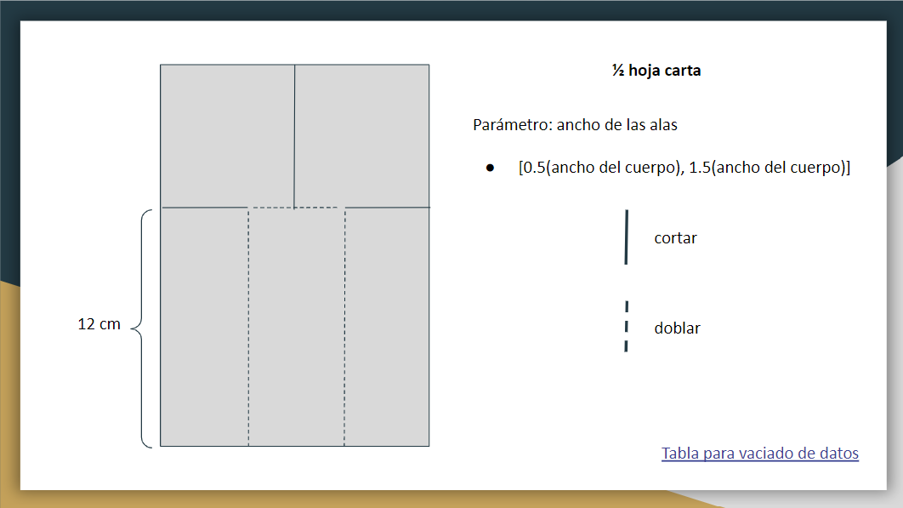

# Helicopteros de papel

El objetivo de este ejercicio es diseñar un helicóptero de papel que tome el mayor tiempo posible en llegar al suelo al dejarlo caer desde una altura fija. 

El helicóptero debe tener la forma especificada en el template adjunto.
La anchura de las alas son los únicos parámetros que pueden ser modificados.

Diseñe, secuencialmente, de cuando menos 25 helicópteros y registre en un archivo los parámetros del helicóptero y el tiempo que le toma llegar al suelo.

Ya que tengamos la base de datos con los experimentos propondremos, con ayuda de un modelo de regresión lineal simple, el diseño que maximice el tiempo esperado de caída.

