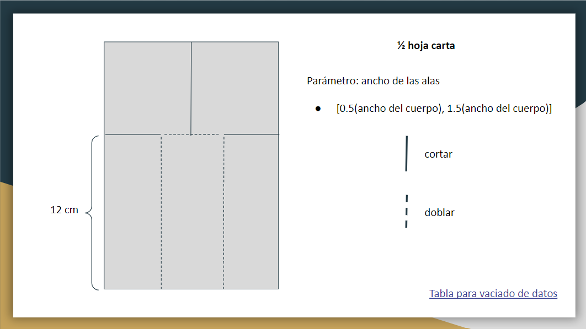

Helicopteros
================

# Helicopteros de papel

El objetivo de este ejercicio es diseñar un helicóptero de papel que
tome el mayor tiempo posible en llegar al suelo al dejarlo caer desde
una altura fija.

El helicóptero debe tener la forma especificada en el template adjunto.
La anchura de las alas son los únicos parámetros que pueden ser
modificados.

Diseñe, secuencialmente, de cuando menos 25 helicópteros y registre en
un archivo los parámetros del helicóptero y el tiempo que le toma llegar
al suelo.

Ya que tengamos la base de datos con los experimentos propondremos, con
ayuda de un modelo de regresión lineal simple, el diseño que maximice el
tiempo esperado de caída.



``` r
head(mediciones)
```

    ## # A tibble: 6 x 4
    ##      id ancho_ala tiempo_vuelo grupo
    ##   <dbl>     <dbl> <chr>        <dbl>
    ## 1     1      2    00:01.21         2
    ## 2     2      2.4  650 ms           1
    ## 3     3      2.49 690 ms           2
    ## 4     4      2.58 870 ms           2
    ## 5     5      2.67 910 ms           2
    ## 6     6      2.76 940 ms           1

## Limpieza de la variable tiempo\_vuelo
