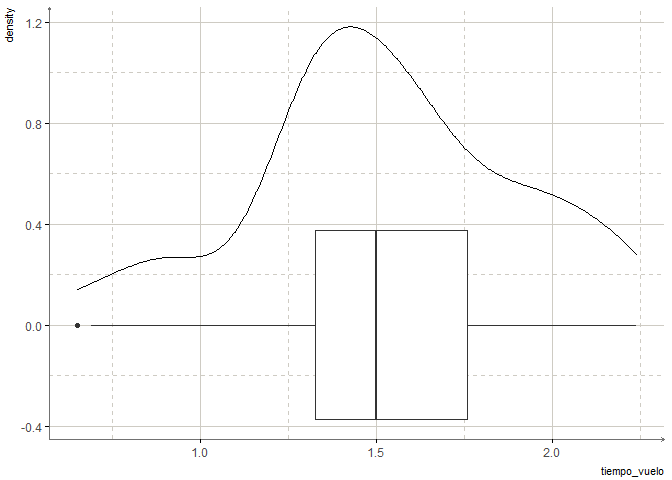
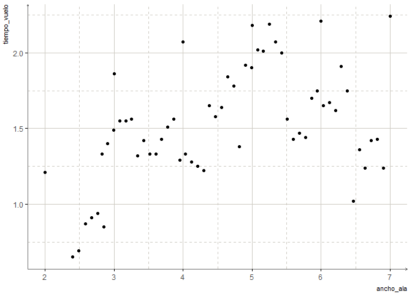

Helicopteros
================

``` r
mediciones %>% 
  sample_n(10)
```

    ## # A tibble: 10 x 4
    ##       id ancho_ala tiempo_vuelo grupo
    ##    <dbl>     <dbl> <chr>        <dbl>
    ##  1    43      5.60 00:01.43         2
    ##  2    52      6.29 00:1.91          1
    ##  3     3      2.49 690 ms           2
    ##  4    59      6.9  1:24s            1
    ##  5    50      6.12 00:1.67          1
    ##  6    58      6.81 1:43s            2
    ##  7    40      5.34 2.07 seg         1
    ##  8    41      5.42 2                2
    ##  9    36      5    00:02.18         2
    ## 10     4      2.58 870 ms           2

## Limpieza de la variable tiempo\_vuelo

Salvo 6 mediciones, todas están en segundos por tanto vamos a
estandarizar las mediciones a segundos.

Primero seleccionamos las mediciones en milésimas de segundos:

``` r
ms <- which(str_detect(mediciones$tiempo_vuelo, "ms"))

mediciones$tiempo_vuelo[ms]
```

    ## [1] "650 ms" "690 ms" "870 ms" "910 ms" "940 ms" "850 ms"

Y les damos formato de segundos:

``` r
# library(stringr)

mediciones$tiempo_vuelo[ms] <- mediciones$tiempo_vuelo[ms] %>% 
  str_remove("ms") %>% 
  as.numeric()/1000

mediciones$tiempo_vuelo[ms]
```

    ## [1] "0.65" "0.69" "0.87" "0.91" "0.94" "0.85"

El resto, que están en segundos, les quitamos los ceros que aparecen
antes del simbolo *:*, los simbolos *:* que aparecen al inicio, los
simbolos *:* que aparecen en medio los remplazamos por un punto y
finalmente quitamos las palabras *seg* y *s*, todo esto usando
expresiones regulares.

``` r
mediciones$tiempo_vuelo <- mediciones$tiempo_vuelo %>% 
  str_remove_all("0*(?=:)") %>% 
  str_remove_all("^:") %>% 
  str_replace(":", ".") %>% 
  str_remove_all("[^[:digit:]|[:punct:]]") %>% 
  as.numeric()

mediciones$tiempo_vuelo
```

    ##  [1] 1.21 0.65 0.69 0.87 0.91 0.94 0.85 1.33 1.40 1.49 1.86 1.55 1.55 1.56 1.32
    ## [16] 1.42 1.33 1.33 1.43 1.51 1.56 1.29 2.07 1.33 1.28 1.25 1.22 1.65 1.58 1.64
    ## [31] 1.84 1.78 1.38 1.92 1.90 2.18 2.02 2.01 2.19 2.07 2.00 1.56 1.43 1.47 1.44
    ## [46] 1.70 1.75 2.21 1.65 1.67 1.62 1.91 1.75 1.02 1.36 1.24 1.42 1.43 1.24 2.24

### Función de limpieza

**¿Qué hacer si tenemos que repetir constantemente este proceso?**

Imaginemos que constantemente recibimos información de tiempo con las
mismas incosistencias que hemos corregido, para reutilizar nuestro
proceso de limpieza la mejor práctica en R es crear funciones con las
cuales evitaremos reescribir todo nuestro código o tener que editar
nuestro script.

La función de limpieza se construiría de la siguiente forma:

``` r
limpia_tiempos <- function(tiempos){
  
  ms <- which(str_detect(tiempos, "ms"))
  
  tiempos[ms] <- tiempos[ms] %>% 
    str_remove("ms") %>% 
    as.numeric()/1000
  
  limpios <- tiempos %>% 
    str_remove_all("0*(?=:)") %>% 
    str_remove_all("^:") %>% 
    str_replace(":", ".") %>% 
    str_remove_all("[^[:digit:]|[:punct:]]") %>% 
    as.numeric()
  
  return(limpios)
}
```

Y así la utilizaríamos en los datos anteriores:

``` r
ugly_tiempos
```

    ##  [1] "00:01.21"     "650 ms"       "690 ms"       "870 ms"       "910 ms"      
    ##  [6] "940 ms"       "850 ms"       "00:01.33 seg" "00:01.40 seg" "00:01.49 seg"
    ## [11] "00:01.86"     "00:01.55 seg" "00:01.55 seg" "00:01.56 seg" "00:01.32 seg"
    ## [16] "00:01.42"     "00:01.33"     "00:01.33"     "00:01.43"     "00:01.51"    
    ## [21] "00:01.56"     "0:01:29"      "00:02.07"     "0:01:33"      "0:01:28"     
    ## [26] "0:01:25"      "0:01:22"      "00:01.65"     "00:01.58"     "00:01.64"    
    ## [31] "00:01.84"     "00:01.78"     "00:01.38"     "1.92 seg"     "1.9 seg"     
    ## [36] "00:02.18"     "2.02 seg"     "2.01 seg"     "2.19 seg"     "2.07 seg"    
    ## [41] "2"            "00:01.56"     "00:01.43"     "00:01.47"     "00:01.44"    
    ## [46] "00:01.70"     "00:1.75"      "0:02:21"      "00:1.65"      "00:1.67"     
    ## [51] "00:1.62"      "00:1.91"      "00:1.75"      "1:02s"        "1:36s"       
    ## [56] "1:24s"        "1:42s"        "1:43s"        "1:24s"        "00:02.24"

``` r
limpia_tiempos(ugly_tiempos)
```

    ##  [1] 1.21 0.65 0.69 0.87 0.91 0.94 0.85 1.33 1.40 1.49 1.86 1.55 1.55 1.56 1.32
    ## [16] 1.42 1.33 1.33 1.43 1.51 1.56 1.29 2.07 1.33 1.28 1.25 1.22 1.65 1.58 1.64
    ## [31] 1.84 1.78 1.38 1.92 1.90 2.18 2.02 2.01 2.19 2.07 2.00 1.56 1.43 1.47 1.44
    ## [46] 1.70 1.75 2.21 1.65 1.67 1.62 1.91 1.75 1.02 1.36 1.24 1.42 1.43 1.24 2.24

## Análisis descriptivo

**¿Cuál es la distribución del tiempo de vuelo?**

``` r
# remotes::install_github("alberto-mateos-mo/unam.theme")
# library(ggplot2)
# library(unam.theme)

ggplot(mediciones)+
  geom_density(aes(tiempo_vuelo))+
  geom_boxplot(aes(tiempo_vuelo))+
  theme_unam()
```

<!-- -->

\_\_¿Hay alguna relación entre el tiempo de vuelo y el ancho del ala?

``` r
ggplot(mediciones)+
  geom_point(aes(ancho_ala, tiempo_vuelo))+
  theme_unam()
```

<!-- -->

## Modelo de regresión lineal

Aplicaremos un modelo de regresión lineal que nos ayude a explicar el
tiempo de vuelo usando el ancho de las alas.

``` r
modelo <- lm(tiempo_vuelo~ancho_ala, data = mediciones)

summary(modelo)
```

    ## 
    ## Call:
    ## lm(formula = tiempo_vuelo ~ ancho_ala, data = mediciones)
    ## 
    ## Residuals:
    ##      Min       1Q   Median       3Q      Max 
    ## -0.73780 -0.22081  0.01452  0.20746  0.62067 
    ## 
    ## Coefficients:
    ##             Estimate Std. Error t value Pr(>|t|)    
    ## (Intercept)  0.94899    0.15071   6.297 4.39e-08 ***
    ## ancho_ala    0.12509    0.03138   3.986  0.00019 ***
    ## ---
    ## Signif. codes:  0 '***' 0.001 '**' 0.01 '*' 0.05 '.' 0.1 ' ' 1
    ## 
    ## Residual standard error: 0.3346 on 58 degrees of freedom
    ## Multiple R-squared:  0.215,  Adjusted R-squared:  0.2015 
    ## F-statistic: 15.89 on 1 and 58 DF,  p-value: 0.0001903
